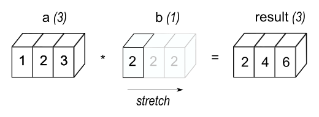
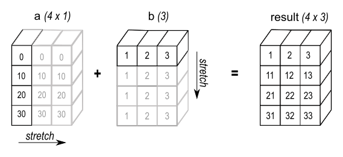

<style>
.reveal pre.code {max-width: 60%;  margin-left: auto; margin-right: auto; max-height: 80%}
.reveal pre.code-wrapper {max-width: 60%;  margin-left: auto; margin-right: auto; max-height: 80%}
</style>

# The Importance of Vectorization

## Avoiding Loops Unless Necessary

***Milan Ondrašovič***

[rossum.ai](https://rossum.ai)

milan.ondrasovic@gmail.com, milan.ondrasovic@rossum.ai

---

## Personal Introduction

* **Milan Ondrašovič**, 28 years old
* Studied **applied informatics**
* Doctorate degree in **deep machine learning**
* Currently working as a **machine learning research engineer** at [Rossum](https://rossum.ai)

---

## Prerequisites

* Knowledge of the Python programming language
* Basic experience with NumPy library

---

### What is meant by vectorization?

* The process of implementing an algorithm so that multiple instructions can be executed in parallel
  * A concomitant absence of any explicit looping, indexing, etc., in the code.

--

### What is NOT meant by vectorization?

* It is not the process of converting from a bitmap image to a vector representation.
* Nor is it a linear transformation which converts a matrix into a column vector.

---

### Vectorization Example

* Assume a task of computing a sum of squares of multiple numbers
* Let $\mathbf{x} = [ x_1, x_2, \dots, x_n ]$ be a list of $n$ real numbers, such that $x_i \in \mathcal{R}$, for $i = 1, \dots, n$
* The sum of squares is defined as

$$s = \sum_{i = 1}^{n} x_i^2$$

--

Generate $100\ 000$ random integers in interval $<0, 1000)$

```Python
vals = np.random.randint(low=0, high=1_000, size=100_000)
```

Standard (inefficient) loop-based implementation

```Python {data-line-numbers="3-4"}
def calc_squared_sum_basic(vals):
    result = 0
    for val in vals:
        result += val ** 2
    return result
```

Standard (improved) comprehension-based implementation

```Python {data-line-numbers="2"}
def calc_squared_sum_comprehension(vals):
    return sum(val ** 2 for val in vals)
```

Non-standard (efficient) vectorized implementation

```Python {data-line-numbers="2"}
def calc_squared_sum_vectorized(vals):
    return np.sum(np.asarray(vals) ** 2)
```

---

### Broadcasting

* It stands at the core of vectorizing array operations to make looping efficient
* Assuming certain conditions are met, the smaller array is “broadcast” across the larger array to assure shape compatibility
 * Fun fact: even some mathematical books, e.g., [Deep Learning](https://www.deeplearningbook.org/) by *I. Goodfellow*, *Y. Bengio*, and *A. Courville*, have adopted the broadcasting notation to simplify formulas, even though it's "against the rules" of linear algebra

---

 ### Broadcasting Rules

<br>
<br>
<br>

<small>Images source: [NumPy documentation](https://numpy.org/doc/stable//user/basics.broadcasting.html) ([BSD license](https://numpy.org/doc/stable/license.html))</small>

---

### Boradcasting Rules
