<style>
  h2 {
    font-size: 45px;
  }

  h3 {
    font-size: 40px;
  }

  .horizontal-section {
    display: flex;
  }

  .vertical-section {
    display: flex;
    flex-direction: column;
  }

  .important-term-horizontal {
    background-color: #151515; 
    color: #fff; 
    padding: 20px;
    border-radius: 10px;
    margin-right: 10px;
    margin-top: 10px;
    flex: 1;
    text-align: center;
  }

  .important-term-vertical {
    background-color: #151515; 
    color: #fff; 
    padding: 20px;
    border-radius: 10px;
    margin-bottom: 10px;
    flex: 1;
    text-align: center;
  }

  .advantage-section {
    background-color: #08a684;
    color: #fff; 
    padding: 10px;
    border-radius: 10px;
    margin-right: 10px;
    margin-top: 10px;
    flex: 1;
    text-align: center;
  }

  .disadvantage-section {
    background-color: #a83232;
    color: #fff; 
    padding: 10px;
    border-radius: 10px;
    margin-right: 10px;
    margin-top: 10px;
    flex: 1;
    text-align: center;
  }

  footer {
    color: #ccc;
  }
</style>

<!--
_header: ''
_footer: 📧 milan.ondrasovic@gmail.com | 📃 https://github.com/mondrasovic
_paginate: false
-->


# **Unlocking Efficiency**

## ***The Power of Vectorization***

***Milan Ondrašovič***

<span style="font-size:50%">Originally presented at **PyData Prague** - 29. 2. 2024</span>
<span style="font-size:50%">Modified version presented at **Faculty of Management Science and Informatics** - 26. 3. 2024</span>

<span style="font-size:40%">**Machine learning research engineer** at [ROSSUM](https://rossum.ai) Czech Republic, s.r.o.</span>

---
<!--
_backgroundImage: radial-gradient(circle, #093466, #041b36);
_paginate: False
-->
# Introduction

---
<!--
header: Introduction - Prerequisite Knowledge
_footer: https://python.org | https://numpy.org
backgroundImage: linear-gradient(to top, #202228, #171717)
-->
## Prerequisites


<div class="horizontal-section">
  <div class="important-term-horizontal">
    🐍
    <br>
    Python
  </div>

  <div class="important-term-horizontal">
    🔢
    <br>
    NumPy
  </div>

  <div class="important-term-horizontal">
    📝
    <br>
    Algebra
  </div>
</div>

---
<!--
header: Introduction - Terminology
_footer: ★It's not **image conversion** (bitmap to vector representation) or a **matrix transformation** (matrix to column vector)
-->
## What is meant by vectorization?


<div class="horizontal-section">
  <div class="important-term-horizontal">
    Rewriting code to utilize vector operations, enabling loop execution in languages like C/C++ or Fortran to leverage SIMD instructions for computational efficiency★
  </div>
</div>

<br>
<br>

> Rule of thumb: "***Avoid loops unless necessary!***"

<!--
Looping is executed in optimized C rather than Python
-->

---
<!--
_header: Introduction - Motivation for University Students (Extra Slide)
_footer: Vectorization is a **paradigm of thinking** rather than just a library to use, it **requires practice**❗
-->
## Vectorization and Machine Learning

<div class="horizontal-section">
  <div class="important-term-horizontal">
  Vectorization is an indispensable part of machine learning - unless you're willing to wait days to finish your computation (sometimes)😏
  </div>
</div>

- **Data scientists**: data cleaning and preprocessing, Exploratory Data Analysis (EDA), time series analysis
- **Machine learning engineers**/**researchers** - feature engineering, model training and inference, neural network computations 

---
<!--
_header: ""
_backgroundImage: radial-gradient(circle, #093466, #041b36);
_paginate: False
-->
# Motivating Example

---
<!--
header: Vectorization Example - "Sum of Squares" Task
-->
## Vectorization Demo - Task Definition


<div class="horizontal-section">
  <div class="important-term-horizontal">
    Compute a sum of squares of multiple numbers
  </div>
</div>

Let $\mathbf{x} = [ x_1, x_2, \dots, x_n ]$ be a list of $n$ real numbers. The *sum of squares* is defined as

$$s = \sum_{i = 1}^{n} x_i^2$$

---
<!--
_footer: Comprehensions are **concise** and often **faster** (with exceptions... like this one 😄)
-->
## Pure Python Implementation


```Python
def calc_squared_sum_basic(vals):
    result = 0
    for val in vals:
        result += val ** 2
    return result
```

```Python
def calc_squared_sum_comprehension(vals):
    return sum(val ** 2 for val in vals)
```

> Use comprehensions if appropriate

---
## Vectorized Implementation


```Python
import numpy as np

def calc_squared_sum_vectorized(vals):
    return np.sum(np.asarray(vals) ** 2)
```

---
<!--
_header: ""
_footer: Hardware Specification: CPU: AMD Ryzen™ 5 5500, 6 cores/12 threads, Max. boost clock 4.2GHz, L2 cache 3MB 
-->
## Benchmarking - Statistics

<!--  -->

<span style="font-size:40%">**Minimum time** in **seconds** from $10$ arithmetic means of $100$ function executions</span>

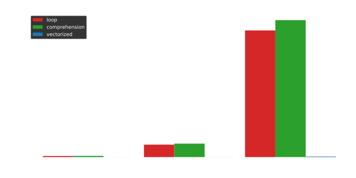

---
<!--
_header: ""
_backgroundImage: radial-gradient(circle, #093466, #041b36);
_paginate: False
-->
# Common Use Cases

---
<!--
header: Diverse Use Cases
_footer: There are **countless of libraries** already encompassing plethora of applications
-->
## Adoption Among Various Libraries


* ⚖️ Similar approach to vectorization "syntax", e.g.:
  * [NumPy](https://numpy.org/doc/)
  * [PyTorch](https://pytorch.org/)
  * [TensorFlow](https://www.tensorflow.org/)
* 🏛️ Many libraries are built on top of NumPy, e.g.:
  * [opencv-python](https://pypi.org/project/opencv-python/)
  * [scikit-learn](https://scikit-learn.org/stable/)
  * [scikit-image](https://scikit-image.org/)

---
<!--
header: (Subjectively) Feels Like a Domain-Specific Language (DSL) 
_footer: ★This is just a **personal feeling**, not a general statement
-->
## DSL-Like Aspects


<div class="horizontal-section">
  <div class="important-term-horizontal">
    🤔
    <br>
    Writing vectorized code feels like working with a domain-specific language (DSL)★
  </div>
</div>

<br>

---
<!--
header: Properties Resembling a Domain-Specific Language (DSL) 
-->


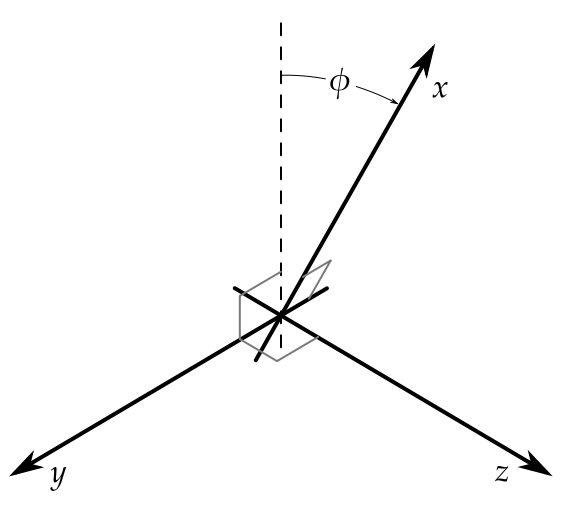
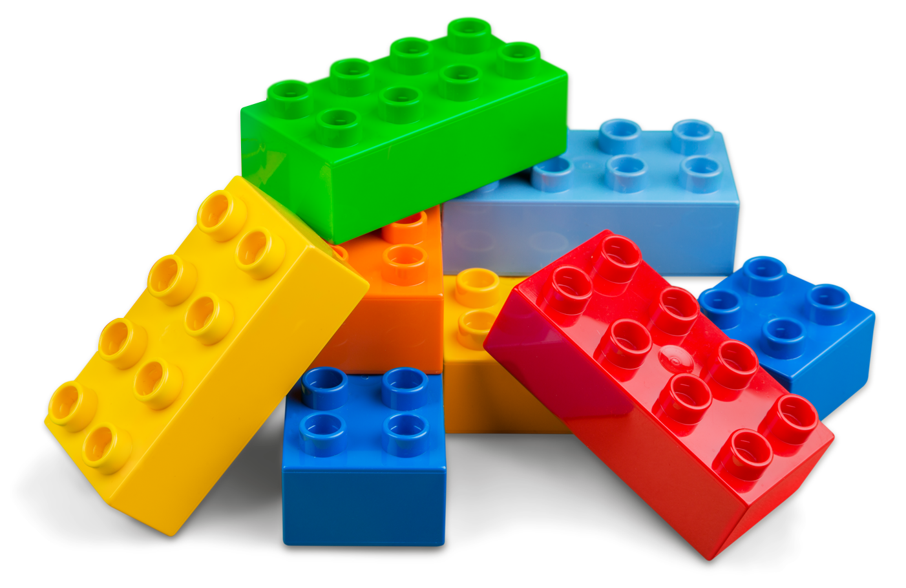

<div class="horizontal-section">
  <div class="important-term-horizontal">
    🔢
    <br>
    Conciseness and expresiveness
  </div>

  <div class="important-term-horizontal">
    🧠
    <br>
    Shift in perspective
  </div>

  <div class="important-term-horizontal">
    🛠️
    <br>
    "Standard" tooling
  </div>
</div>

<br>

* High-level abstractions
* Array-oriented thinking
* Library functions and built-in operators

---
<!--
header: Similar Roles, Different Use Cases
_footer: This list of **roles** and **applications** is just illustrative, not exhaustive 🙂
-->
## Use Cases for Various Roles

<div class="horizontal-section">
  <div class="important-term-horizontal">
    💻
    <br>
    Programmers 
  </div>

  <div class="important-term-horizontal">
    📊
    <br>
    Data scientists
  </div>

  <div class="important-term-horizontal">
    🧠
    <br>
    ML engineers
  </div>
</div>

<br>

* Numerical computing
* Data preprocessing and *Exploratory Data Analysis*
* Machine learning model training and inference

---
<!--
_header: ""
_backgroundImage: radial-gradient(circle, #093466, #041b36);
_paginate: False
-->
# Vectorization Impacts

---
<!--
_header: Vectorization Impacts - General Overview
-->
## Impacts of Vectorization On Code


<br>
<br>
<br>

<div class="horizontal-section">
  <div class="important-term-horizontal">
    ⏲️
    <br>
    Execution
  </div>

  <div class="important-term-horizontal">
    💻
    <br>
    Implementation
  </div>

  <div class="important-term-horizontal">
    🗒️
    <br>
    Codebase
  </div>
</div>

---
<!--
header: Impacts On Code Execution
_footer: These statements **generally hold true**, but sometimes they don't (**exceptions exist**) :shrug:
-->
## Execution Speed and Loading Time

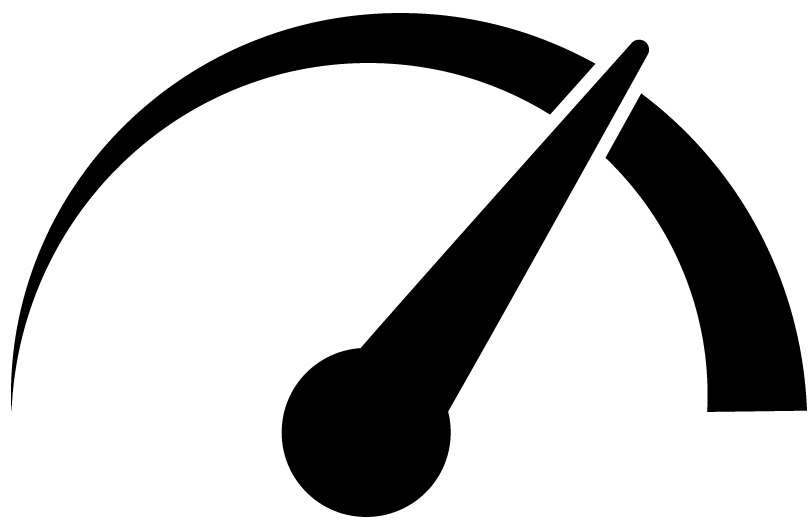


<div class="vertical-section">
  <div class="advantage-section">
    👍 Even 1000x faster
  </div>
  <div class="advantage-section">
    👍 Parallel instruction execution 
  </div>
  <div class="disadvantage-section">
    👎 Slower if used improperly
  </div>
  <div class="disadvantage-section">
    👎
    Longer loading times (heavy imports)
  </div>
</div>

---
<!--
_footer: For certain **Mac GPU** 🍎 devices, there is `torch.device("mps")` (*Metal Performance Shaders*) | https://pytorch.org/
-->
## Transparency

<div class="horizontal-section">
  <div class="advantage-section">
    👍
    <br>
    In some libraries, transparent execution on both CPU and GPU
  </div>
  <div class="disadvantage-section">
    👎
    <br>
    Sometimes, need to transfer data between RAM and GPU RAM
  </div>
</div>

```Python
import torch

device = torch.device("cuda" if torch.cuda.is_available() else "cpu")
cpu_tensor = torch.randn(3, 3)
gpu_tensor = cpu_tensor.to(device)
```

<!-- Some operations are not available across all the execution backends -->

---
<!--
_footer: Underlying **optimizations** with respect to data types might violate some **Pythonic assumptions** 😱
-->
## Data Types

<div class="horizontal-section">
  <div class="advantage-section">
    👍
    <br>
    Internal data type-specific optimizations
  </div>
  <div class="disadvantage-section">
    👎
    <br>
    Automatic conversion pitfalls
  </div>
</div>

```Python
>>> py_list = ["ab", "cde"]
>>> py_list[0] = "fghi"
>>> py_list  # The first element is completely replaced
['fghi', 'cde']
>>> np_array = np.asarray(["ab", "cde"])
>>> np_array[0] = "fghi"
>>> np_array  # The string is truncated - max. length is 3
array(['fgh', 'cde'], dtype='<U3')
```

---
<!--
_footer: Example on the next slide ➡️
-->
## Code Behavior and Error Handling

<div class="vertical-section">
  <div class="advantage-section">
    👍 Expected behavior across libraries
  </div>
  <div class="advantage-section">
    👍 Less error-prone code
  </div>
  <div class="disadvantage-section">
    👎 Certain assumptions may mislead 
  </div>
  <div class="disadvantage-section">
    👎 Internal errors (C/C++) are "unreadable"
  </div>
</div>

<br>

> To paraphrase *Donald Knuth*:
> "Built-in optimization *may* be the root of *some* evil"

---
<!--
_header: ""
_footer: It's better to **assume** that you are working with a **view**, unless proven otherwise 😱
-->
## Views Vs. Original Arrays

```Python
>>> py_list = [1, 2, 3, 4]
>>> py_list_new = py_list[:2]  # A new copy is created
>>> py_list_new[0] = 5
>>> py_list_new
[5, 2]
>>> py_list  # No modification to the original data
[1, 2, 3, 4]

>>> np_array = np.asarray([1, 2, 3, 4])
>>> np_array_new = np_array[:2]  # Just a view is created
>>> np_array_new[0] = 5
>>> np_array_new
array([5, 2])
>>> np_array  # The original array has been modified
array([5, 2, 3, 4])
```

---
<!--
header: Impacts On Codebase
_footer: In this regard, if something goes wrong, then it does so spectacularly! 😆
-->
## Maintenance and Portability

<div class="vertical-section">
  <div class="advantage-section">
    👍 Outsourcing computation to an external library
  </div>
  <div class="advantage-section">
    👍 Often painless porting between libraries
  </div>
  <div class="disadvantage-section">
    👎 Dependency on an external library
  </div>
  <div class="disadvantage-section">
    👎 Some operations are not available in all libraries
  </div>
</div>

<br>

> There is a fine line between vectorizing and obfuscating

---
## Readability and Onboarding

<div class="vertical-section">
  <div class="advantage-section">
    👍 Brevity can be a blessing
  </div>
  <div class="advantage-section">
    👍 Easier knowledge transfer
  </div>
  <div class="disadvantage-section">
    👎 Brevity can be a curse
  </div>
  <div class="disadvantage-section">
    👎 A priori knowledge of vectorization required
  </div>
</div>

<br>

> Even a seasoned programmer may feel like a newbie

---
<!--
_header: ""
_backgroundImage: radial-gradient(circle, #093466, #041b36);
_paginate: False
-->
# Broadcasting

---
<!--
header: Broadcasting
_footer: ★For example, the book "**Deep Learning**" by I. Goodfellow, Y. Bengio, and A. Courville
-->
## Broadcasting

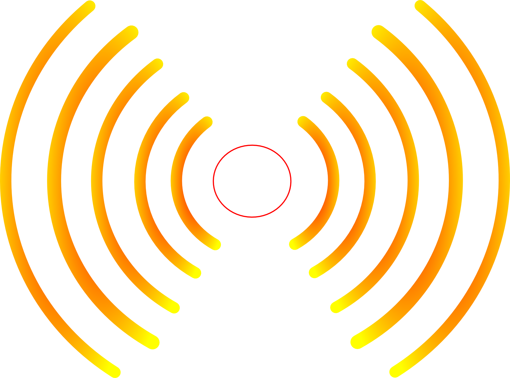

<div class="horizontal-section">
  <div class="important-term-horizontal">
    The smaller array is “broadcast” across the larger array to assure shape compatibility
  </div>
</div>

<br>

The `np.broadcast_to` function "simulates" the effect

### Fun Fact

Even some mathematical books★ have adopted the *broadcasting notation* to simplify formulas

---
## Rules

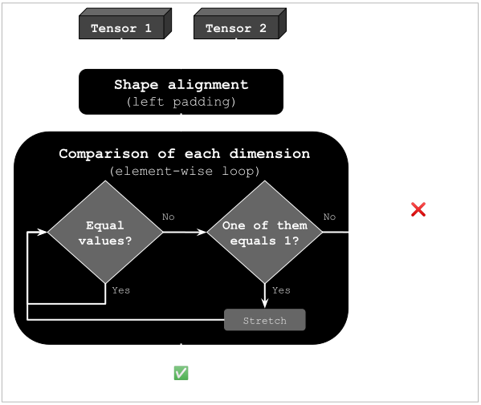

---
<!--
header: ""
-->
## Broadcasting - Single Array (1D)


```Python
>>> import numpy as np
>>> a = np.asarray([1, 2, 3])  # Shape: (3,)
>>> b = 2  # Equivalents: np.asarray(2), [2], (2,)
>>> a * b  # (3,) * () | (3,) * (1,) | (3,) * (3,)
array([2, 4, 6])
```

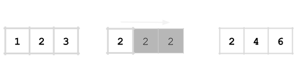

---
## Broadcasting - Single Array (2D)


```Python
>>> import numpy as np
>>> a = np.asarray([[0, 0, 0], [10, 10, 10], [20, 20, 20], [30, 30, 30]])  # Shape: (4, 3)
>>> b = np.asarray([1, 2, 3])  # Shape: (3,)
>>> a + b  # (4, 3) + (3,) | (4, 3) + (1, 3) | (4, 3) + (4, 3)
array([[ 1,  2,  3],
       [11, 12, 13],
       [21, 22, 23],
       [31, 32, 33]])
```

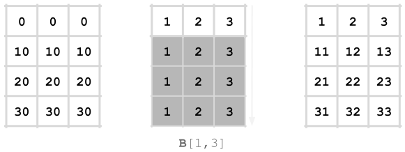

---
## Broadcasting - Both Arrays (2D)


```Python
>>> import numpy as np
>>> a = np.asarray([0, 10, 20, 30])[..., np.newaxis]  # Shape: (4, 1)
>>> b = np.asarray([1, 2, 3])  # Shape: (3,)
>>> a + b  # (4, 1) + (3,) | (4, 1) + (1, 3) | (4, 3) + (1, 3) | (4, 3) + (4, 3)
array([[ 1,  2,  3],
       [11, 12, 13],
       [21, 22, 23],
       [31, 32, 33]])
```

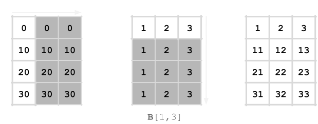

---
<!--
_header: ""
_backgroundImage: radial-gradient(circle, #093466, #041b36);
_paginate: False
-->
# Einstein Notation

---
<!--
header: Einstein Summation Notation/Convention
_footer: https://en.wikipedia.org/wiki/Einstein_notation
-->
## Einstein Notation


<div class="horizontal-section">
  <div class="important-term-horizontal">
    Notational convention that implies summation over a set of indexed terms, thus achieving brevity
  </div>
</div>


$$y = \sum_{i = 1}^{3} c_i \mathbf{x}^i = c_1 \mathbf{x}^1 + c_2 \mathbf{x}^2 + c_3 \mathbf{x}^3$$

is simplified into

$$y = c_i \mathbf{x}^i$$

---
## Einstein Summation


<div class="horizontal-section">
  <div class="important-term-horizontal">
    Concise and efficient method for various tensor operations utilizing string notation to specify indexing
  </div>
</div>

> Advice: If possible, standard functions should be preferred to `np.einsum`

---
## Element Sum (Example)

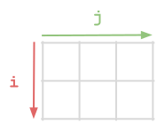

```Python
>>> import numpy as np
>>> arr = np.asarray([[1, 2, 3], [4, 5, 6]])
>>> np.einsum("ij ->", arr)
21
>>> np.sum(arr)
21
```

---
<!--
_header: ""
-->
## Matrix Multiplication (Example)

```Python
>>> import numpy as np
>>> a = np.asarray([[1, 2, 3], [4, 5, 6]])
>>> b = np.asarray([[1, 2], [3, 4], [5, 6]])
>>> np.einsum("ik, kj -> ij", a, b)
array([[22, 28],
       [49, 64]])
>>> np.matmul(a, b)  # Or equivalently `a @ b`
array([[22, 28],
       [49, 64]])
```

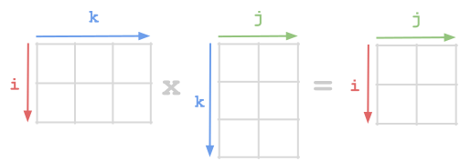

---
<!--
_footer: For **arbitrary swapping of axes**, see `np.swapaxes`
-->
## Transpose of a Matrix (Example)

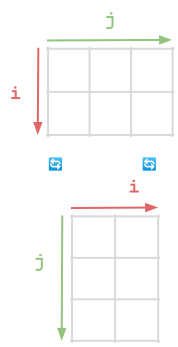

```Python
>>> import numpy as np
>>> arr = np.asarray([[1, 2, 3], [4, 5, 6]])
>>> np.einsum("ji", arr)  # Notice the order of indices
array([[1, 4],
       [2, 5],
       [3, 6]])
>>> np.transpose(arr)  # Or equivalently `arr.T`
array([[1, 4],
       [2, 5],
       [3, 6]])
```

---
<!--
header: Einstein Notation Taken to the Next Level
_footer: Supports **NumPy**, **PyTorch**, **TensorFlow**, **JAX**, and others 😍 | https://pypi.org/project/einops/
-->
## Einstein "Operations" Notation

<div class="horizontal-section">
  <div class="important-term-horizontal">
  String-based notation (similar to Einstein's) to perform various tensor operations 🤸 ️
  </div>
</div>

```Python
>>> import numpy as np
>>> from einops import rearrange, reduce, repeat
>>> img = np.random.random((128, 256, 3))  # Shape: (height, width, n_channels)
>>> rearrange(img, "height width n_channels -> n_channels height width").shape 
(3, 128, 256)
>>> reduce(img, "height width n_channels -> width height", "max").shape
(256, 128)
>>> repeat(img, "height width n_channels -> height (tile width) n_channels", tile=2).shape
(128, 512, 3)
```

---
<!--
_header: ""
_backgroundImage: radial-gradient(circle, #093466, #041b36);
_paginate: False
-->
# Other Performance Tips

---
<!--
header: Improving Performance - Several Tips and Tricks
_footer: Beware of memory **spatial** and **temporal locality** - big arrays, big difference!🤔
-->
## Row-major vs. Column-major

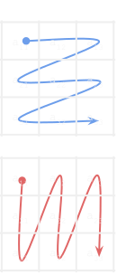

<div class="vertical-section">
  <div class="important-term-vertical">
    C-contiguous: row-major (default)
  </div>
  <div class="important-term-vertical">
    Fortran-contiguous: column-major
  </div>
</div>

```Python
>>> import numpy as np
>>> np.arange(6).reshape(2, 3, order="C")
array([[0, 1, 2],
       [3, 4, 5]])
>>> np.arange(6).reshape(2, 3, order="F")
array([[0, 2, 4],
       [1, 3, 5]])
```

---
<!--
_footer: 💡`np.hstack`, `np.vstack`, and `np.stack` use `np.concatenate` internally - **axis** and **memory order** impact the speed
-->
## Modifying Arrays

<div class="vertical-section">
  <div class="important-term-vertical">
    Arrays allocated as a contiguous block of memory
  </div>
</div>

**Avoid resizing memory** in a loop - if needed, **pre-allocate** it using `np.empty` and then fill in place

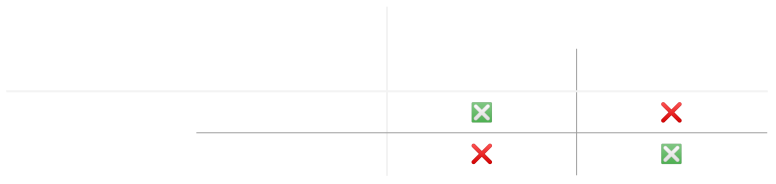

---
<!--
_footer: 💡Use `new_arr.base is orig_arr` to test whether `new_arr` is just a **view** of `orig_arr` and not a new **copy**
-->
## View vs. Copy

```Python
import numpy as np
arr = np.asarray([1, 2, 3, 4, 5, 6])  # `np.asarray` does not copy, `np.array` does
```

```Python
sliced_arr = arr[1:4]  # VIEW
reshaped_arr = arr.reshape(2, -1)  # VIEW | Shape: (2, 3)
transposed_arr = arr[np.newaxis].T  # VIEW | Shape: (6, 1)
raveled_arr = orig_arr.ravel()  # VIEW | Shape: (6,)
```

```Python
mask_selected_arr = arr[[False, True, True, True, False, False]]  # COPY
fancy_indexed_arr = arr[[1, 2, 3]]  # COPY
flattened_arr = orig_arr.flatten()  # COPY | Shape: (6,)
```

---
<!--
_footer: '💡★**Universal function** (`ufunc`) - operates on `ndarrays` in an **element-by-element** fashion'
-->
## Unbuffered In-place Operations

Family of *universal functions*★: `np.ufunc.at`, `np.ufunc.reduce`, `np.ufunc.accumulate`, etc.

```Python
>>> import numpy as np
>>> arr_buffered = np.asarray([1, 2, 3, 4, 5])
>>> arr_buffered[[0, 0, 0]] += 1  # BUFFERING increments only once (keeps track)
>>> arr_buffered
array([2, 2, 3, 4, 5])

>>> arr_unbuffered = np.asarray([1, 2, 3, 4, 5])
>>> np.add.at(arr_unbuffered, [0, 0, 0], 1)  # No BUFFERING increments 3 times
>>> arr_unbuffered
array([4, 2, 3, 4, 5])  # First element: 1 + (3 * 1) = 4
```


---
<!--
_footer: 💡Some mathematical operations have their **numerically stable counterparts** - look for them
-->
## Prefer Numerically Stable Functions


<div class="horizontal-section">
  <div class="important-term-horizontal">
    ♾️
    <br>
    Overflow
  </div>
  <div class="important-term-horizontal">
    0️⃣
    <br>
    Underflow 
  </div>
</div>

* $e^x - 1$
  * `np.exp(x) - 1`⚠️, `np.expm1(x)`✅
* $\log \left( 1 + x \right)$
  * `np.log(1 + x)`⚠️, `np.logp1(x)`✅
* and *many others*... 🙄

---
<!--
_header: ""
_backgroundImage: radial-gradient(circle, #093466, #041b36);
_paginate: False
-->
# Making Vectorization Easier

---
<!--
header: Making Vectorization Easier - A Few Hints Out of Many
_footer: Expedite your implementation by **on-the-fly interaction with code**
-->
## Harnessing `jupyter`'s Power


<div class="vertical-section">
  <div class="important-term-vertical">
    ⌨️
    <br>
    Interactive mode - data inspection
  </div>

  <div class="important-term-vertical">
    ⏲️
    <br>
    Visualization - plotting
  </div>

  <div class="important-term-vertical">
    👀
    <br>
    Data shape exploration
  </div>
</div>

---
<!--
_footer: Array operations can generally be grouped into "**mapping**" and "**reducing**" | https://en.wikipedia.org/wiki/MapReduce
-->
## Map/Reduce Patterns

<div class="horizontal-section">
  <div class="important-term-horizontal">
    Map
    <br>
    (dimension preserving)
  </div>

  <div class="important-term-horizontal">
    Reduce
    <br>
    (dimension reducing)
  </div>
</div>

```Python
>>> import numpy as np
>>> vals = np.asarray([[1, 2, 3], [4, 5, 6]])  # Shape: (2, 3)
>>> np.power(vals, 2)  # MAPPING - preserves shape (2, 3)
array([[ 1,  4,  9],
       [16, 25, 36]])
>>> np.sum(vals, axis=1)  # REDUCTION - removes an axis, shape (2,)
array([ 6, 15])
```

<span style="font-size:60%">**Reduction** happens along an `axis` parameter (`keepdims=True` possible)</span>

---
<!--
_footer: Always **keep your documentation and comments up to date** - if they lie, it is worse than nothing! ⚠️
-->
## Commenting Tensor Shapes

* Consider adding shapes as a comment
  * single-letter: `# (R, C)`
  * variable name (preferred): `# (n_rows, n_cols)`

```Python
def softmax(logits: np.ndarray) -> np.ndarray:
    """Transform `logits` of shape `(n_rows, n_cols)` using softmax."""
    scores = np.exp(logits)  # (n_rows, n_cols)
    row_sums = np.sum(scores, axis=1, keepdims=True)  # (n_rows, 1)
    eps = np.finfo(np.float32).eps
    probabilities = scores / (row_sums + eps)  # (n_rows, n_cols)
    return probabilities
```

---
<!--
_footer: 💡Not very common approach, just be aware of its existence
-->
## Using Advanced Type Hints

```Python
from typing import Annotated, Literal, TypeVar
import numpy as np
import numpy.typing as npt

DType = TypeVar("DType", bound=np.generic)

Array4 = Annotated[npt.NDArray[DType], Literal[4]]
Array3x3 = Annotated[npt.NDArray[DType], Literal[3, 3]]
ArrayNxNx3 = Annotated[npt.NDArray[DType], Literal["N", "N", 3]]
```

---
<!--
_header: ""
_backgroundImage: radial-gradient(circle, #093466, #041b36);
_paginate: False
-->
# Conclusion

---
<!--
_header: Final Thoughts - Key Takeaways
_footer: '**Thank you very much for any kind of attention!** 😄 | ***Milan Ondrašovič*** | milan.ondrasovic@gmail.com'
-->
## Vectorization - Conclusion


* ⏲️ Useful for **performance-demanding** applications
  * 🔃 **Looping** is performed in **low-level** languages
* 👍 Potential to vastly **improve the solution**
* 🧠 **Educational value** - learn the basic principles
  * 😱 Beware of **underlying differences**
* 📓 It has become an **industry "standard"**
* 📚 Plenty of **resources**, solid **community support**

> ❗It is just a tool, so don't eat soup with a fork❗
